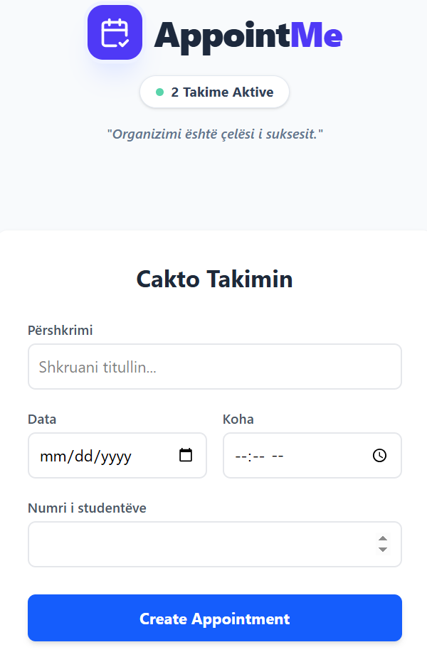

# Appointment Manager

A simple appointment and attendance management web application built with React.

This project demonstrates real-world React fundamentals such as state management, controlled forms, derived state, and persistent storage.

---

## ✨ Features

- Create appointments with date, time, and capacity
- Add and remove attendees
- Capacity-based logic (Open / Full status)
- Disable actions when capacity is reached
- Clear UX feedback for full appointments
- Persistent data using LocalStorage
- Warning for double booking (same date & time)
- Responsive and clean UI

---

## 📸 Preview



---

## 🛠️ Tech Stack

- React
- Context API
- Tailwind CSS
- LocalStorage
- JavaScript (ES6+)

---

## 🧠 What This Project Demonstrates

- Proper state lifting and immutability
- Separation of business logic and UI
- Derived state (capacity & status)
- Clean component structure
- Realistic UX decisions
- Scalable architecture for future features

---

## 🚀 Getting Started

```bash
npm install
npm run dev
